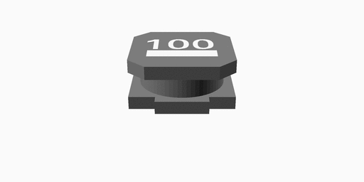
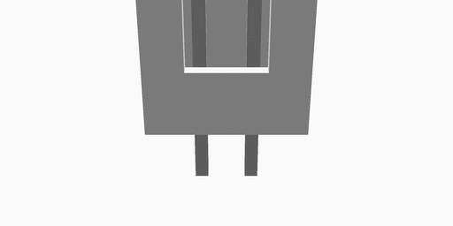
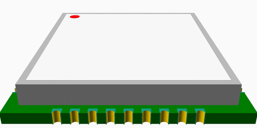
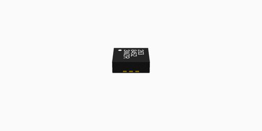
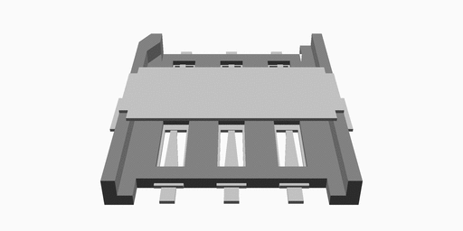
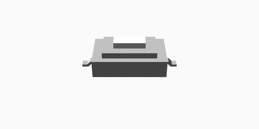
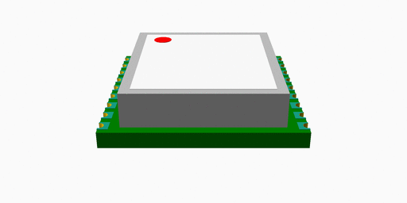
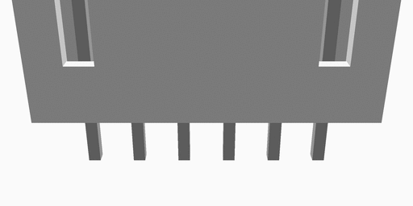
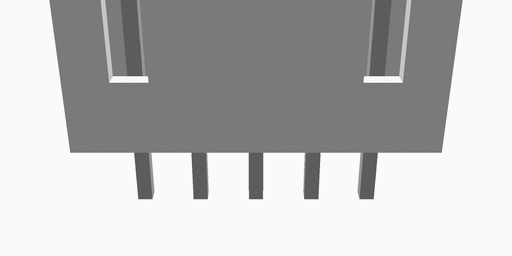
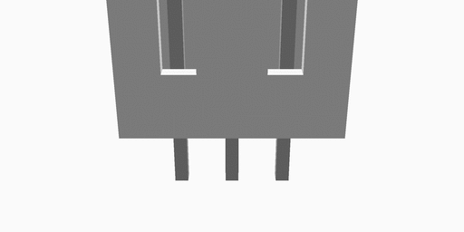

## Список компонентов библиотеки

1.  Inductor_NR6028T100M
1.  FUSE_1812
1.  GPS_25_25_4
1.  W7600-02
1.  FUSE_1206
1.  SIM800C
1.  MMA8452Q
1.  SI37C_SIM_HOLDER
1.  RS-282G05A3
1.  SIM68M
1.  W7600-06
1.  W7600-05
1.  W7600-03
